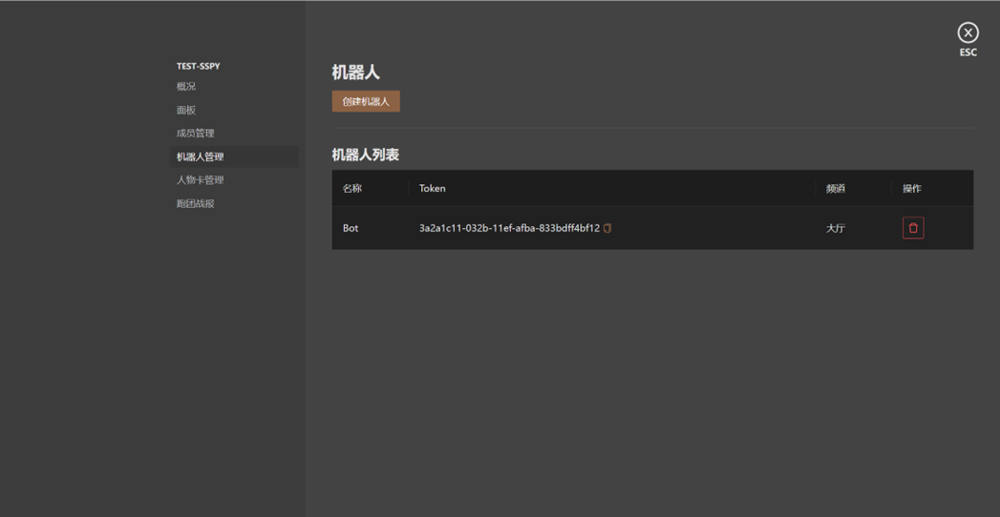
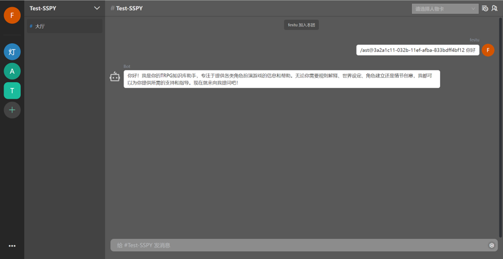

# COC-Assistant 跑团助手


## 背景

COC（Call of Cthulhu）跑团是一种基于克苏鲁神话背景的桌面角色扮演游戏。在COC跑团中，玩家扮演的角色通常是普通人，如调查员、学者、侦探等，他们会接受一些奇怪事件的调查任务。这些事件通常涉及到邪恶的神秘力量、古老的神话生物和超自然现象。

COC跑团的特点是恐怖氛围和扭曲的现实感。玩家将置身于克苏鲁神话的世界中，经历恐怖的事件和心理上的恐惧。游戏中的敌人往往超乎人类的理解，并且对抗它们往往是危险而困难的。游戏注重**角色扮演**和**故事叙述**，强调玩家对角色的思考和决策。

COC跑团通常由一个主持人（Keeper）来引导整个游戏过程，创造和控制游戏世界中的情节和角色。主持人负责提供游戏的背景设定、描述环境、扮演非玩家角色，并根据玩家的行动来推动故事的发展。

COC 跑团本质上是一个合作叙事游戏，玩家与主持人将通过角色扮演的方式，合力创作一个惊心动魄、跌宕起伏的冒险/悬疑故事。

COC 跑团游戏目前面临着诸多问题，一方面随着互联网的传播，传统的线下桌游逐渐被线上形式取代，这不仅使得玩家的交流变得困难，而且也削减了传统桌游的乐趣。另一方面是 COC 跑团有着极其复杂而严苛的规则，这使得该游戏的上手门槛较高。

而大语言模型的出现让上述问题有了转机，其广泛的知识面、强大的叙事能力能够给线上跑团游戏提供非常丰富的帮助，如时代背景的提示、叙事创作的参考、规则的查询与解读，大语言模型丰富的知识允许其扮演 类型丰富的 NPC 加入到游戏中，提供更多样化、更便利的游戏体验。

## 介绍

我们结合了检索增强生成模型（RAG）与模型微调等方法构建了该 COC Assistant 助手模型，我们投喂了大量 COC 相关的资料进行训练。我们的数据集涵盖了 COC 官中的规则书、来自各大论坛与平台的 COC 规则集以及在线跑团日志，旨在提供 **COC 跑团规则查询与解答**、**背景故事的查询**、**场景设定和推演**的提示、**内容创作**的辅助、**NPC 扮演**等功能。

它是您和您的团队在游戏中的绝佳助手，具备丰富的专业知识和强大的理解叙事能力。不论是 COC 跑团新手还是颇有经验的玩家，不论是线上游戏还是线下面团，我们的模型都能为您提供帮助和参考。

更多有关 LLM 开发的内容可参考：[书生·浦语大模型实战营课程](https://github.com/InternLM/tutorial.git)

## 模型开发

基座模型使用 internlm-chat-7b，通过 Langchain 工程构建与 XTuner 微调来开发模型。

### Langchain

基于 Langchain 构建向量数据库，存储经过清洗和处理后的数据集。

#### 数据集

我们使用来自 COC 官方的规则书以及来自各大论坛的规则集构建数据库。原始数据集的形式有很多种，主要类型有 PDF 与 TXT。我们使用 Langchain 内置模块读取 pdf 文件内容，并基于**规则**内容模块对数据集文本进行内容分块。

数据库搭建如下：

```python
text_splitter = RecursiveCharacterTextSplitter(
    chunk_size=500, chunk_overlap=150)
split_docs = text_splitter.split_documents(docs)

# 加载开源词向量模型
embeddings = HuggingFaceEmbeddings(model_name="/root/FF/model/sentence-transformer")

# 构建向量数据库
# 定义持久化路径
persist_directory = 'data_base/vector_db/chroma'
# 加载数据库
vectordb = Chroma.from_documents(
    documents=split_docs,
    embedding=embeddings,
    persist_directory=persist_directory  # 允许我们将persist_directory目录保存到磁盘上
)
# 将加载的向量数据库持久化到磁盘上
vectordb.persist()
```

#### 提示工程

提示工程来提升大语言模型处理复杂任务场景的能力，如问答和算术推理能力。
通过设计提示词，可以控制大语言模型回复的内容和格式。经过多轮测试，选择效果较好的提示词

最终提示词如下：
```
You will act as a character in a tabletop role-playing game, as well as an assistant in this game.

When you receive a question starting with <助理>, you will respond as an assistant.
- As an assistant, you can only answer based on the information you know. If you don't know the answer to a question, you should indicate so and not fabricate information to respond.

When you receive a question starting with <NPC>, you will respond as a character in the game.
- As an Character,Never forget you are the Character in the game.
- I will propose actions I plan to take and you will explain what happens when I take those actions.
- Speak in the first person from the perspective of your Character.
- For describing your own body movements, wrap your description in '*'.
- Do not change roles!
- Stop speaking the moment you finish speaking from your perspective.
- You need to respond as the character you are playing, based on the dialogue or environmental descriptions in the question.
- Be creative and imaginative.
```


### 微调

使用 `XTuner ` 训练。

#### XTuner

数据集主要使用了各大论坛与仓库中提供的在线跑团日志，将跑团日志转化为问答式数据集后，我们使用这些数据集对模型进行微调，结合提示工程的设置来提高模型的角色扮演能力与 COC 场景推演能力。

数据集示例：

```json
[{"conversation": [{"system": "你是一次桌面RPG游戏中的NPC，你将在故事中扮演一个角色，与其余玩家进行互动", "input": "<KP>:进灯塔的两名男士发现走廊通往四个房间：书房，宿舍，厨房，以及食物 贮藏室。房间看起来都安装了电灯泡，但只有书房的灯还亮着。", "output": ":“太好了，这里有灯。”看到光亮有些欣喜，去书房那里 看一眼，“嘿，有谁在吗？”"}]},
{"conversation": [{"system": "你将在一个桌面RPG游戏中作为一个骰子，辅助其余玩家推动故事发展", "input": "<KP>:通过困难侦查", "output": "<骰子>:埃尔南·彼特拉克的\"困难侦查\"检定结果为: D100=61/37 一路上总会遇\n到点解决不了的难关，这没什么。（失败）"}]},
{"conversation": [{"system": "你是一次桌面RPG游戏中的NPC，你将在故事中扮演一个角色，与其余玩家进行互动", "input": "<KP>:查尔斯发现了走廊上的灯线。借着灯光，你还发现走廊地板里嵌着两颗子\n弹。\n可以过手枪或智力", "output": ":“有子弹？！这是怎么了！”我大惊失色。"}]}]
```

## 机器人接口

扩展应用接口，提供机器人服务，用于与模型交互。

在聊天室设置中创建机器人，在聊天室中通过提交特定格式的信息，即可通过内置接口与我们的助手模型交互：




